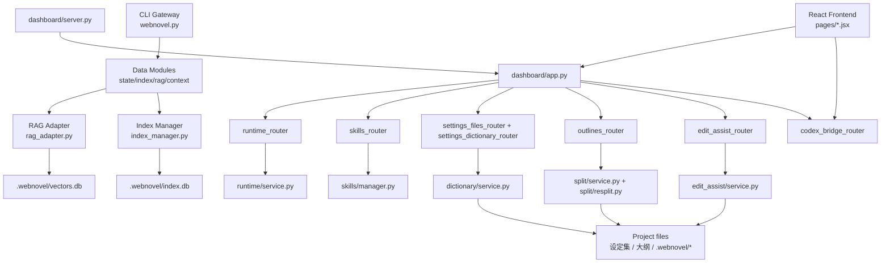
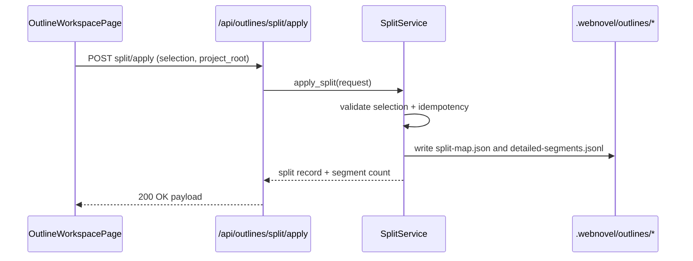
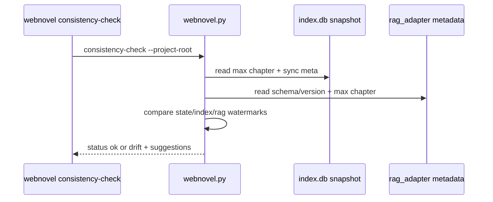

> generated_by: nexus-mapper v2
> verified_at: 2026-03-27
> provenance: Mixed. Router-to-service links are code-verified from imports and include_router wiring; some cross-system dependencies are inferred from endpoint contracts and docs.

# Dependencies

## System Graph

## Key Flow: Outline Split Apply

## Key Flow: RAG Consistency Check

## Dependency Risks Relevant to PRD

- Frontend write capability is spread across `SettingsPage`, `OutlineWorkspacePage`, `SkillsPage`, and Codex-launch actions in `FilesPage`; converting to pure display will touch multiple API adapters and page actions.
- RAG verification touches both command dispatch (`webnovel.py`) and retrieval implementation (`rag_adapter.py`) plus tests in `scripts/data_modules/tests/test_rag_adapter.py`.
- Workspace safety enforcement appears in both dashboard service layer and CLI pointer resolution; standardizing Codex flow should define one authoritative resolution strategy.
